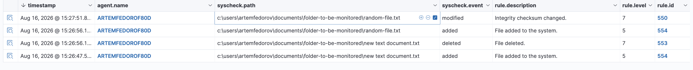

# Wazuh File Integrity Monitoring (FIM) — Technical Writeup

**Component:** Wazuh syscheck (FIM) module, integrated with Sysmon
**Environment:** Windows endpoint (agent) → Wazuh manager (cloud, free trial)

## 1. Objective

Configure Wazuh's File Integrity Monitoring (`syscheck`) module to detect, in real time, the three core file-level events on a designated directory:

1. File creation (`added`)
2. File modification (`modified`)
3. File deletion (`deleted`)

A secondary goal was to enrich visibility by feeding Sysmon event log data into Wazuh via the Windows Event Channel log collector, so file-system activity can eventually be correlated with process-level telemetry from the same host.

## 2. Architecture

```
Windows endpoint (agent: ARTEMFEDOROF80D)
 ├─ Sysmon (sysmon-modular config) → Microsoft-Windows-Sysmon/Operational event log
 │        │
 │        └─ Wazuh agent <localfile> (eventchannel) ──┐
 │                                                      │
 └─ Wazuh agent syscheck (realtime FIM on target dir) ──┤
                                                         ▼
                                              Wazuh manager (cloud, free trial)
                                                         │
                                                         ▼
                                          Rule engine → alerts.json / dashboard
```

Monitored path: `C:\Users\artemfedorov\Documents\folder-to-be-monitored`

## 3. Configuration

### 3.1 Sysmon integration (`ossec.conf`)

Sysmon events are ingested via the Windows Event Channel log collector, pointed at the standard Sysmon operational log:

```xml
<localfile>
  <location>Microsoft-Windows-Sysmon/Operational</location>
  <log_format>eventchannel</log_format>
</localfile>
```

Sysmon itself was configured using the community-maintained ruleset:
[olafhartong/sysmon-modular — sysmonconfig.xml](https://github.com/olafhartong/sysmon-modular/blob/master/sysmonconfig.xml)

### 3.2 FIM / syscheck configuration (`ossec.conf`)

The target directory is monitored with `realtime` enabled, so changes are detected immediately via the OS-level file system watcher rather than waiting for the default periodic scan interval:

```xml
<directories realtime="yes">C:\Users\artemfedorov\Documents\folder-to-be-monitored</directories>
```

Using `realtime="yes"` (as opposed to the default scheduled/scan-based checking) is what allows create/modify/delete events to appear in the dashboard within seconds of the action occurring, rather than only at the next scheduled syscheck run.

## 4. Test procedure

To validate detection of all three file operations, the following actions were performed against files inside the monitored directory:

| Step | Action | Target file |
|---|---|---|
| 1 | Create | `new text document.txt` |
| 2 | Delete | `new text document.txt` |
| 3 | Create | `random-file.txt` |
| 4 | Modify (content change) | `random-file.txt` |

## 5. Results — alert evidence

Captured directly from the Wazuh dashboard (Security Events view), filtered to `syscheck` alerts for the agent `ARTEMFEDOROF80D`:



| Timestamp (Aug 16, 2026) | Path | Event | Rule Description | Level | Rule ID |
|---|---|---|---|---|---|
| 15:27:51.8 | `...\folder-to-be-monitored\random-file.txt` | `modified` | Integrity checksum changed. | 7 | 550 |
| 15:26:56.1 | `...\folder-to-be-monitored\random-file.txt` | `added` | File added to the system. | 5 | 554 |
| 15:26:56.1 | `...\folder-to-be-monitored\new text document.txt` | `deleted` | File deleted. | 7 | 553 |
| 15:26:47.5 | `...\folder-to-be-monitored\new text document.txt` | `added` | File added to the system. | 5 | 554 |

**Observations:**

- All three event types (`added`, `modified`, `deleted`) were correctly classified by Wazuh's built-in syscheck ruleset, each triggering a distinct rule ID.
- `modified` and `deleted` events were scored at a higher rule level (7) than `added` events (5), reflecting that content changes and deletions are treated as more significant than new file creation by the default ruleset.
- The `modified` event on `random-file.txt` was flagged specifically because the file's **integrity checksum** changed — confirming syscheck is doing content-hash comparison, not just a timestamp/metadata check.
- Detection latency was on the order of seconds, consistent with `realtime="yes"` file-system-event-driven monitoring rather than polling.

